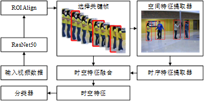

# ST-Transformer-GAR-GC

基于时空Transformer的群体活动识别（Group Activity Recognition）系统，结合图卷积（Graph Convolution）技术，用于视频中的人群行为分析和识别。

## 📋 项目简介

本项目实现了一个端到端的**多粒度层次化**群体活动识别框架，采用**个体→群组→人群**的三级识别架构，能够从视频序列中同时识别个体行为、群组行为和群体活动。系统采用ResNet50作为特征提取骨干网络，通过ROI Align提取个体特征，利用Transformer架构进行时空特征融合，通过群组建模实现多粒度特征聚合，最终实现准确的群体活动分类。

## 🏗️ 系统架构



系统架构包含以下主要模块：

1. **输入视频数据** - 原始视频帧序列
2. **ResNet50** - 特征提取骨干网络
3. **ROI Align** - 感兴趣区域对齐，提取个体特征
4. **选择关键帧** - 基于注意力机制的关键帧选择
5. **空间特征提取器** - 提取个体间的空间关系特征
6. **时序特征提取器** - 提取时间序列中的运动特征
7. **时空特征融合** - 融合空间和时间特征
8. **分类器** - 最终的行为分类

## 🔄 多粒度识别流程

本系统采用**三级层次化识别架构**，从细粒度到粗粒度逐步聚合特征：

### 第一层：个体粒度（Individual Level）
- **输入**：视频帧序列 + 个体边界框
- **处理**：
  - 通过ResNet50提取帧级特征
  - 使用ROI Align提取每个个体的空间特征
  - 基于注意力机制选择关键时序帧
- **输出**：个体行为特征和个体行为分类（如：站立、行走、举手等）

### 第二层：群组粒度（Group Level）
- **输入**：个体特征序列 + 群组划分信息
- **处理**：
  - 根据群组信息将个体特征重组为群组特征
  - 使用空间Transformer提取群组内个体间的交互关系
  - 使用时序Transformer提取群组的时间演化模式
  - 通过池化操作聚合群组内特征
- **输出**：群组行为特征和群组行为分类（如：排队、聚集、分散等）

### 第三层：人群粒度（Crowd Level）
- **输入**：群组特征序列
- **处理**：
  - 使用时序Transformer提取群组间的时序关系
  - 融合所有群组特征，考虑不同群组对整体活动的贡献度
  - 结合个体直接推理和群组推理的双路径特征
- **输出**：群体活动分类（如：排队、等待、移动、聚集、分散等）

### 多粒度特征融合
系统通过以下方式实现多粒度特征的融合：
- **个体直接推理路径**：直接从个体特征推理群体活动
- **群组推理路径**：通过群组特征推理群体活动
- **双路径融合**：将两条路径的结果加权融合，提高识别准确率

## ✨ 主要特性

- 🎯 **多粒度层次化识别**：采用个体→群组→人群的三级识别架构，实现从细粒度到粗粒度的特征聚合
- 🔄 **关键帧选择**：基于注意力机制自动选择关键时序帧，提高计算效率
- 🧩 **群组建模**：支持动态人群场景下的群组识别和建模，捕捉群组内和群组间的交互关系
- 🔀 **双路径推理**：结合个体直接推理和群组推理的双路径特征融合机制
- 🚀 **端到端训练**：支持端到端的模型训练和推理
- 📊 **灵活配置**：通过YAML配置文件灵活调整模型参数

## 🔧 环境要求

- Python 3.7+
- PyTorch 1.8+
- CUDA (推荐，用于GPU加速)
- 其他依赖包见 `requirements.txt` (如需要可自行创建)

## 📦 安装

1. 克隆仓库：
```bash
git clone <repository-url>
cd ST-Transformer-GAR-GC
```

2. 安装依赖：
```bash
pip install -r requirements.txt
```

或者手动安装：
```bash
pip install torch torchvision
pip install numpy easydict pyyaml
pip install opencv-python pillow matplotlib scikit-learn scikit-image
```

## 🚀 使用方法

### 训练模型

```bash
python train.py
# 或
python main.py  # 在config.yaml中设置 trainOrVal: 'train'
```

### 验证模型

```bash
python val.py
# 或
python main.py  # 在config.yaml中设置 trainOrVal: 'val'
```

### 配置说明

主要配置文件位于 `config/config.yaml`，可以调整以下参数：

- **模型参数**：
  - `embed_features`: 特征嵌入维度（默认512）
  - `encoderLayersNum`: Transformer编码器层数（默认3）
  - `headNum`: 多头注意力头数（默认8）
  - `KEYT`: 关键帧数量（默认4）

- **训练参数**：
  - `train.totalEpochs`: 训练总轮数
  - `train.optimizer.kwargs.lr`: 学习率
  - `train.scheduler.milestones`: 学习率衰减里程碑

- **数据集参数**：
  - `dataset.data_path`: 数据集路径
  - `dataset.train.batch_size`: 训练批次大小
  - `dataset.val.batch_size`: 验证批次大小

## 📁 项目结构

```
ST-Transformer-GAR-GC/
├── config/                 # 配置文件目录
│   ├── config.yaml        # 主配置文件
│   └── config_volleyball.yaml
├── model/                  # 模型定义
│   ├── GARModel.py        # 主模型
│   ├── Transformer.py     # Transformer模块
│   ├── ResNet50.py        # ResNet50骨干网络
│   └── ...
├── util/                   # 工具函数
│   ├── dataset.py         # 数据集加载
│   ├── roi_align.py       # ROI对齐实现
│   └── ...
├── img/                    # 图片资源
│   └── image.png          # 系统架构图
├── main.py                # 主入口（训练/验证）
├── train.py               # 训练脚本
├── val.py                 # 验证脚本
└── README.md              # 项目说明文档
```

## 🎯 模型特点

### 1. 多粒度层次化识别

系统采用三级识别架构，实现从个体到群组再到人群的层次化特征聚合：

- **个体粒度识别**：
  - 提取每个个体的空间-时序特征
  - 识别个体行为（如：站立、行走、举手等）
  - 为上层提供细粒度特征基础

- **群组粒度识别**：
  - 根据群组信息重组个体特征
  - 捕捉群组内个体间的交互关系（空间Transformer）
  - 捕捉群组的时间演化模式（时序Transformer）
  - 识别群组行为（如：排队、聚集、分散等）

- **人群粒度识别**：
  - 融合所有群组特征
  - 考虑不同群组对整体活动的贡献度
  - 结合个体直接推理和群组推理的双路径
  - 识别最终群体活动（如：排队、等待、移动、聚集、分散等）

### 2. 关键帧选择
通过自注意力机制自动选择视频序列中的关键帧，减少计算量并提高模型效率，同时保留最重要的时序信息。

### 3. 群组建模
- 支持动态人群场景下的群组识别（群组可能动态变化）
- 通过群组内特征聚合捕捉群组内部行为模式
- 通过群组间特征融合捕捉群组间的交互关系
- 实现更准确的群体活动识别

### 4. 双路径特征融合
- **路径一：个体直接推理**：直接从个体特征推理群体活动
- **路径二：群组推理**：通过群组特征推理群体活动
- **融合策略**：将两条路径的结果加权融合，充分利用多粒度信息

### 5. 时空特征融合
- **空间特征**：通过Transformer捕捉个体间的空间关系
- **时序特征**：通过Transformer捕捉时间序列中的运动模式
- **融合机制**：有效结合空间和时间信息，形成完整的时空表示

## 📝 数据集

本项目支持以下数据集：
- Collective Activity Dataset
- Volleyball Dataset
- 自定义数据集（需按照相应格式组织）

数据集应包含：
- 视频帧序列
- 边界框标注（bboxes）
- 个体行为标签（actions）
- 群体活动标签（activities）
- 群组信息（groups）

## 🔬 实验结果

模型在多个数据集上取得了良好的性能，具体结果请参考论文或实验报告。

## 📄 许可证

详见 [LICENSE](LICENSE) 文件。

## 🙏 致谢

感谢所有为本项目做出贡献的研究者和开发者。

## 📧 联系方式

如有问题或建议，欢迎提交Issue或Pull Request。

---

**注意**：使用前请确保已正确配置数据集路径和模型检查点路径。

